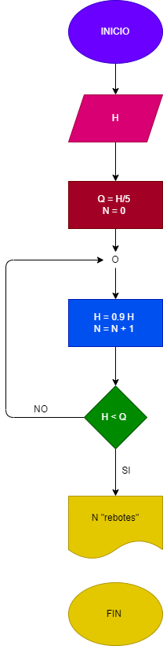

# EJERCICION No. 28

# Una pelota se deja caer desde una altura "H", y en cada rebote sube el 10% menos del anterior. hacer el diagrama de flujo en python, que lea H, y que calcule e imprima en cual rebote la pelota no alcanza a subir la 5 parte de la aluta inicial.

